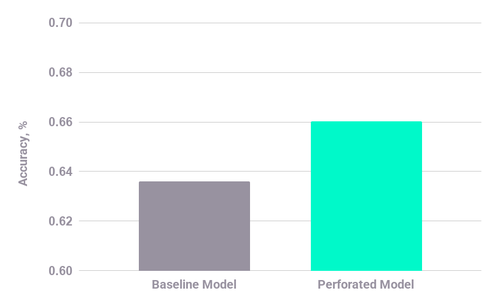

# Wildfire Prediction from Satellite Data (California 2020)

This example demonstrates wildfire prediction using satellite-derived vegetation indices and land surface temperature, comparing:

- Baseline Neural Network (PyTorch)
- Neural Network with PerforatedAI dendrite restructuring

---

## Dataset

The dataset integrates three NASA Earthdata sources:

- FIRMS (VIIRS 375m) – Active fire detections  
- MODIS MOD13Q1 – NDVI & EVI vegetation indices (16-day composite)  
- MODIS MOD11A2 – Land Surface Temperature (8-day composite, averaged to 16-day windows)  

Final processed dataset:

- ~18M valid 1 km² pixels  
- ~0.08% fire pixels (extremely imbalanced)  
- Train / Val / Test split: 70 / 15 / 15  

---

## Experiment

The script automatically runs two versions:

- `is_dendrite = False` ->  Standard MLP  
- `is_dendrite = True` ->  MLP with dynamic dendrite growth  

---

## Dendrite Growth Behavior

During training, three dendrites were added.

Switch events occurred at:

| Epoch | Event                                                                           |
| ----- | ------------------------------------------------------------------------------- |
| 4     | First dendrite added                                                            |
| 11    | Second dendrite added                                                           |
| 16    | Third dendrite added                                                            |
| 20    | Switch attempted but rejected because it did not improve validation performance |

When a switch occurs:

- The best-performing model checkpoint is restored
- A dendrite is added to increase model capacity
- The optimizer and scheduler are reset
- Training continues with the updated architecture

If a new dendrite does not improve validation performance, the previous architecture is restored.

---

### Example Results

Graph of raw validation score during training:




| Model       | Test Accuracy | Precision | Recall | F1         |
| ----------- | ------------- | --------- | ------ | ---------- |
| Baseline    | 61.03%        | 0.6115    | 0.6053 | 0.6084     |
| + Dendrites | 59.76%        | 0.5693    | 0.8014 | 0.6657     |

Dendrites improve overall F1 and recall, dynamically increasing model capacity to better capture rare fire events.

---

### Interpretation


Key changes:

| Metric   | Baseline | Dendrites  |
| -------- | -------- | ---------- |
| Recall   | 0.6053   | **0.8014** |
| F1 Score | 0.6084   | **0.6657** |

Recall improved substantially, meaning the model detects many more true fire events.

This is important because wildfire detection is a rare event problem. Missing a true fire pixel is typically far more costly than generating a few additional false positives.

Dendrites increase model capacity dynamically, allowing the network to capture patterns associated with rare fire events that the baseline architecture could not model effectively.

---

## How to Run

### Install Dependencies

```bash
pip install torch numpy scikit-learn perforatedai
```

### Dataset Location

Expected path:

```
fire_detection_pai_experiments/data/processed/modis_firms_train_val_test_dataset.npz
```

The file must contain:

```
X_train, y_train
X_val, y_val
X_test, y_test
```

### Launch Jupyter

From the project root directory:

```
jupyter notebook
```

Then open:

```
notebooks/fire_dendrite_vs_baseline.ipynb
```

Run all cells.