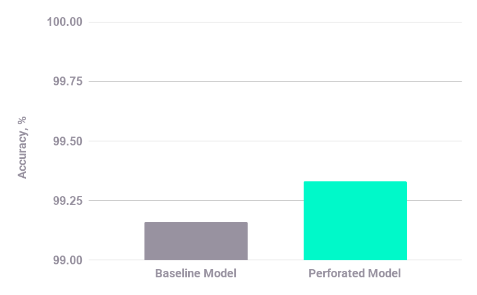

# MNIST and Contributing Example

This folder serves as the template for contributing examples to this repo.  For any contributions please include your output perforated graph as pai_graph.png and your final best_arch_scores file as best_arch_scores.csv.  These should just be included but do not need to be linked in the README.  Please only include a clean graph as below in the README as clean_graph.png.
To generate this graph please use [this template](https://docs.google.com/spreadsheets/d/1oaOg88EQYm40N0HRJKBOu2u8rKoL85CNb1mjb37SHXc/edit?usp=sharing) and fill in the values.

If you would like to add additional files that is welcome, but be sure to have each of these as a minimum.  As examples, appropriate extra files could be:

 - DetailedReport.md
     - An optional detailed writeup with additional content about your example
     - Can include scientific impact or real world considerations for business use cases
 - AdditionalImages
     - folder with any extra images or graphs you'd like to include
 - ___.ipynb
     - A jupyter notebook showing a run of your example.
     - If you create this you should also have it display the final PAI/PAI.png graph that is produced as pai_graph.png

# MNIST With Dendrites

This example adds dendrites to the default mnist example from the pytorch repository.  mnist.py is the original and mnist_perforatedai.py is the baseline changes to add it to the system.

## Installation

Install the required repo with:

    pip install -r requirements.txt

## Running

Run original with:

    python mnist.py

Run dendritic model with:

    python mnist_perforatedai.py

## Outcomes:

Validation scores of original and dendrite optimized networks:

