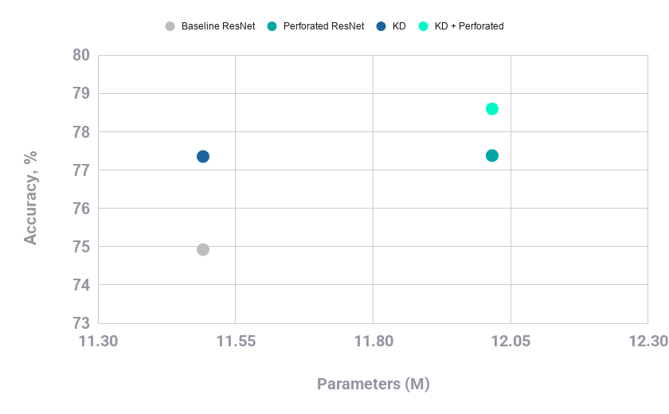

# ResNet18 + PerforatedAI + Knowledge Distillation (Food-101)

This folder contains `train_perforated_resnet_KD.py`, a training script used to run:

- ResNet18 baseline training
- ResNet18 with PerforatedAI dendrite growth
- ResNet18 with Knowledge Distillation (KD) from a ResNet50 teacher
- ResNet18 with both KD and PerforatedAI

## Reported Results

The following results were reported from these Food-101 runs (Top-1 accuracy):

| Experiment | Parameter Count | Top-1 Accuracy |
| --- | ---: | ---: |
| Baseline ResNet18 | 11,490,981 | 74.9228 |
| Perforated ResNet18 (3 dendrites) | 12,016,293 | 77.3782 |
| KD ResNet18 | 11,490,981 | 77.3545 |
| KD + Perforated ResNet18 (2 dendrites) | 12,016,293 | 78.5980 |



Notes:

- Dendrite counts were the highest reached before overfitting started on validation

## What This Script Does

At a high level, `train_perforated_resnet_KD.py` does the following:

1. Loads Food-101 (or CIFAR-100 / ImageNet), with optional dataset download.
2. Uses a stratified labeled subset for training (`--train-label-fraction`).
3. Splits eval data into stratified validation/test halves.
4. Builds a ResNet18 student model.
5. Optionally:
   - pre-trains a ResNet50 teacher (`--pre-train-teacher`)
   - uses KD loss (`--use-kd --teacher-checkpoint ...`)
   - enables PerforatedAI dendrite growth/tracking
6. Trains until PerforatedAI reports completion.
7. Reports validation and holdout test metrics, and tracks parameter count/dendrite count.

## How To Run

Run commands from this directory.

### 1) Train student without KD

Perforated training image and best_arch_scores from this run.

```bash
CUDA_VISIBLE_DEVICES=1 python train_perforated_resnet_KD.py \
  --dataset food101 --download-food101 \
  --wd 0.001 \
  --label-smoothing 0.1 \
  --mixup-alpha 0.2 \
  --cutmix-alpha 0.6 \
  --random-erase 0.2 \
  --auto-augment ta_wide \
  --dropout 0.2
```


### 2) Pre-train the teacher (ResNet50)

```bash
CUDA_VISIBLE_DEVICES=1 python train_perforated_resnet_KD.py \
  --dataset food101 --download-food101 \
  --wd 0.001 \
  --label-smoothing 0.1 \
  --mixup-alpha 0.2 \
  --cutmix-alpha 0.6 \
  --random-erase 0.2 \
  --auto-augment ta_wide \
  --dropout 0.2 \
  --pre-train-teacher
```

This creates a teacher checkpoint (default: `teacher_resnet50_food101.pth`, unless changed with `--teacher-checkpoint`).


### 3) Train student with KD

```bash
CUDA_VISIBLE_DEVICES=1 python train_perforated_resnet_KD.py \
  --dataset food101 --download-food101 \
  --train-label-fraction 0.25 \
  --wd 0.001 \
  --label-smoothing 0.1 \
  --mixup-alpha 0.2 \
  --cutmix-alpha 0.6 \
  --random-erase 0.2 \
  --auto-augment ta_wide \
  --dropout 0.2 \
  --use-kd \
  --teacher-checkpoint teacher_resnet50_food101.pth
```

Important:

- `--use-kd` requires `--teacher-checkpoint`.
- The command with `--use-kd` but no teacher checkpoint is intentionally excluded.

## Reproducing The Exact Comparison

To match the reported table, keep the same data and augmentation settings above, and compare runs by:

- no KD vs KD (`--use-kd` + teacher checkpoint)
- dendrite growth behavior (observed 0, 2, or 3 added dendrites before overfitting)

If you want saved checkpoints/logs, add:

```bash
--output-dir runs/food101_resnet18
```

## Quick Troubleshooting

- If KD errors on Food-101, verify the teacher checkpoint path exists.
- If Food-101 is missing, include `--download-food101`.
- If GPU memory is tight, reduce `--batch-size` (default is 32).
