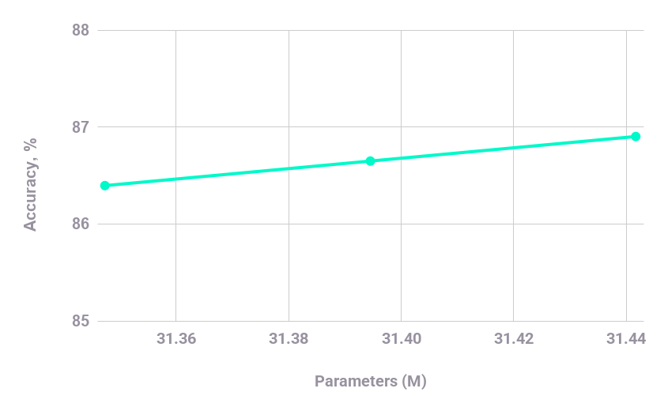

# Video Classification

[Link to Repo](https://github.com/PerforatedAI/LPCV-Track2-EfficientAI-perforated)

## Original Repo Description

The [original repo](https://github.com/shuangtianxiaoye/LPCV-Track2-EfficientAI) was the first place project for Track 2 of the [2026 Qualcomm Low Power Computer Vision Challange](https://lpcv.ai/2026LPCVC/winners/). The Task was to make a highly accurate but also optimized computer vision model for low power video classification.

## Perforated Impact

For this example we only perforated the final fully connected layer of the model and ran with default settings.  Further gains may be possible with other perforation settings and hyperparameter choices.  During training parameters increased by 94,392, 0.3% of the total parameters of the system.  The error rate for per clip accuracy was reduced by almost 4%.  The following graph shows the best scores for each architecture, with zero, one, and two dendrites added.  The model with zero dendrites is the "baseline" that gets produced without any perforation.

| Parameters | Score By Architecture |
|------------|------------------------------|
| 31,347,321 | 86.39538574 |
| 31,394,517 | 86.64862061 |
| 31,441,713 | 86.90184784 |

For the final project models were to be run on ARM devices and tested for full video accuracy rather than per clip.  We ran on a Qualcomm Snapdragon CPU.  While our clips/s processed had a negligible change in speed, when making decisions across full videos the error reduction of the perforated model increases to a full 10%.

| Model | Clips/s | Acc@1 |
|-------|---------|-------|
| Baseline Model | 2.261 | 94.490% |
| Perforated Model | 2.265 | 95.058% |
