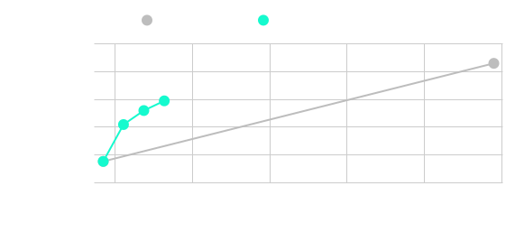

# ImageNet

This folder contains code to train a on the ImageNet dataset starting from the official PyTorch training docs [here](https://github.com/pytorch/vision/tree/main/references/classification#mobilenetv3-large--small).

our huggingfacemodel was trained with the following command:

    CUDA_VISIBLE_DEVICES=0 python -m pdb train_perforated.py --model resnet18 --batch-size 32 --lr 0.0125 --val-resize-size 256 --val-crop-size 224 --train-crop-size 224 --full-dataset --data-path /home/rbrenner/Datasets/imagenet --convert-count 0 --dendrite-mode 1 --improvement-threshold 1 --candidate-weight-init-mult 0.1 --pai-forward-function relu

Results of retained drendrites for the model shown here:

## Additional Files

 - resnet_double.py
   - This file enables a pre_fc layer to be added to a ResNet model so that when perforating during pretraining transfer learning can still be done since replacing the final FC layer would also replace the dendrites if only the FC layer is perforated.
 - train_fast_perforatedai_sweep.py
   - A lightweight training script to sweep hyperparameters without the full dataset before training on the full dataset.  
 - train_perforated_resnet.py
   - Generally the same training script but with defaults for resnet training filled in.
 - train_perforated_resnet_data_efficiency.py
   - An experiment that allows a user to decide what percent of the training data to actually train on.  This file is what was used to verify perforated models can surpass accuracy of baseline models with 25% less data.
